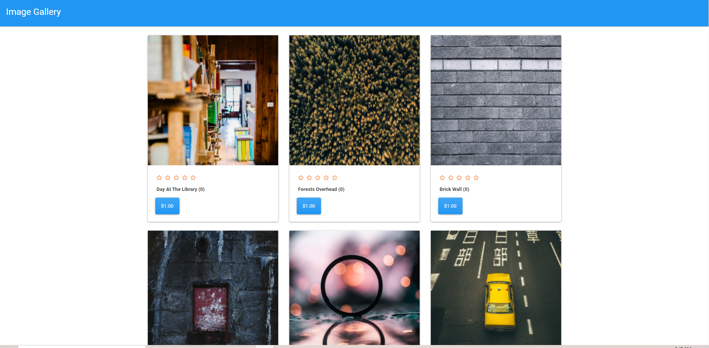

# Image Store

## Description

This project was created to show how to implement the Stripe API. It's a simple image gallery marketplace where the user can click on the purchase button for each image and be redirected to Stripe's checkout page.

## Table of Contents

-[Installation](#installation)

-[Usage](#usage)

-[License](#license)

-[Contributing](#contributing)

-[Tests](#tests)

-[Questions](#questions)

-[Author](#author)

-[Screenshots](#screenshots)

## Installation

You will need a Stripe account to run this. Please clone the repo then run npm install. Add the Stripe public key to loadimages.js and the secret key to your .env file. Also ensure you have Mongo installed and then run seeder.

## Usage

This app is for test use only.

## License

MIT License

Copyright (c) 2021 Stuart Wong

Permission is hereby granted, free of charge, to any person obtaining a copy
of this software and associated documentation files (the "Software"), to deal
in the Software without restriction, including without limitation the rights
to use, copy, modify, merge, publish, distribute, sublicense, and/or sell
copies of the Software, and to permit persons to whom the Software is
furnished to do so, subject to the following conditions:

The above copyright notice and this permission notice shall be included in all
copies or substantial portions of the Software.

THE SOFTWARE IS PROVIDED "AS IS", WITHOUT WARRANTY OF ANY KIND, EXPRESS OR
IMPLIED, INCLUDING BUT NOT LIMITED TO THE WARRANTIES OF MERCHANTABILITY,
FITNESS FOR A PARTICULAR PURPOSE AND NONINFRINGEMENT. IN NO EVENT SHALL THE
AUTHORS OR COPYRIGHT HOLDERS BE LIABLE FOR ANY CLAIM, DAMAGES OR OTHER
LIABILITY, WHETHER IN AN ACTION OF CONTRACT, TORT OR OTHERWISE, ARISING FROM,
OUT OF OR IN CONNECTION WITH THE SOFTWARE OR THE USE OR OTHER DEALINGS IN THE
SOFTWARE.

## Contributing

None

## Tests

None

## Questions

If you have any questions or issues, please forward them to me at swong31@gmail.com.

## Author

[www.github.com/swong1200](https://github.com/swong1200)

## Screenshots

